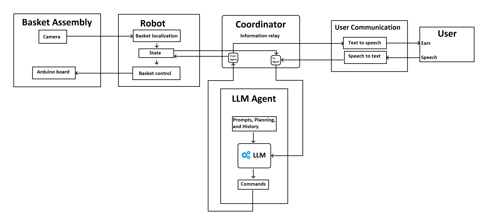

This is an implementation of an LLM-powered agent that can control a simple actuated basket to meet the user's verbalized goal. It uses pyfirmata to control the actuating motors for the basket, OpenCV to detect the basket location, the Python SpeechRecognition library and pyttsx3 to process voice inputs and speak system responses, and OpenAI for the LLM capabilities.

The point is to explore how an AI with control of physical objects could be practically useful. One target example scenario (which the agent can correctly handle) is the following:
- You are at the "Desk" (one of the predefined locations that the agent and the vision system "know" about).
- Your drink is by the "Closet" (another known location).
- You want your drink brought to you, and your friend so happens to be near the closet.

In this scenario, you would say to the AI: "I am at the desk. My drink is by the closet. I want my drink brought to me. My friend is at the closet". The AI will then realize that it needs to incorporate the friend into the equation, make a plan to move the basket to the closet, lower the basket, ask the friend to put the drink in the basket, raise the basket, bring the basket to the desk, and lower the basket.

Here is a diagram of the system components:

The workflow is as follows:
1. Setup - the basket assembly needs to be set up and some parameters need to be calibrated to the environment (the recognition relies on simple feature tracking and comparison to a predefined motion range, which varies with the physical setup)
2. Command the agent to do something, e.g. setting up the example scenario mentioned earlier.
